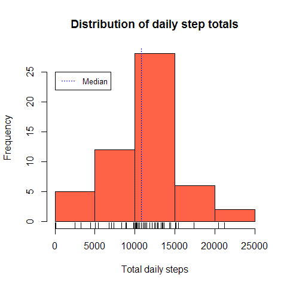
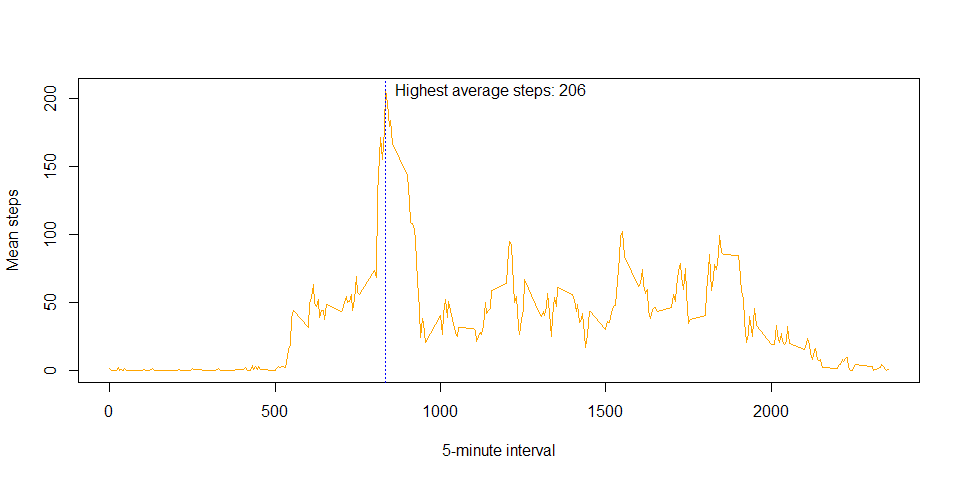
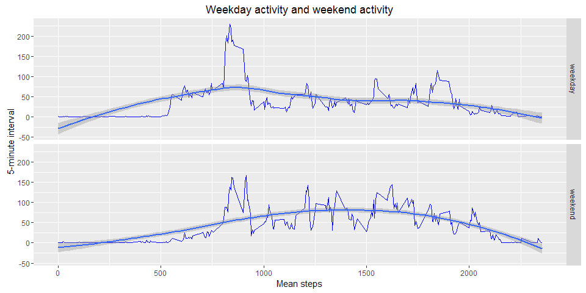

Reproducible Research assignment 1
==================================

##Introduction
This project uses data taken from a personal activity monitoring device. The 
device collects data at 5 minute intervals throughout the day. Here take a 
brief look at the data that has been collected and some basic patterns.

##Data
The data is from the activity monitor of one, anonymous individual over a 
period of two months (October & November, 2012). It is recorded as the number 
of steps done in 5-minute intervals each day. The dataset is stored as a CSV 
file with a total of 17,568 observations.

The variables in the source file *activity.csv* are:

* **steps:** Number of steps taking in a 5-minute interval (missing values are 
coded as NA)
* **date:** The date on which the measurement was taken in YYYY-MM-DD format
* **interval:** Identifier for the 5-minute interval in which measurement was 
taken


###Sourcing the data
The data is available with this coursera course from [cloudfront][1].

```r
sourceUrl <- 
        "https://d396qusza40orc.cloudfront.net/repdata%2Fdata%2Factivity.zip"
zipPath <- "data/repdata_data_activity.zip"
if(!file.exists("data")) dir.create("data") ## Check data directory present
if(!file.exists(zipPath)) download.file(sourceUrl, destfile=zipPath)
```

###Pre-Processing
The activity data is read into the *rawData* for review.

```r
rawData <- read.csv(unz(zipPath, "activity.csv"))
head(rawData)
```

```
##   steps       date interval
## 1    NA 2012-10-01        0
## 2    NA 2012-10-01        5
## 3    NA 2012-10-01       10
## 4    NA 2012-10-01       15
## 5    NA 2012-10-01       20
## 6    NA 2012-10-01       25
```

```r
str(rawData)
```

```
## 'data.frame':	17568 obs. of  3 variables:
##  $ steps   : int  NA NA NA NA NA NA NA NA NA NA ...
##  $ date    : Factor w/ 61 levels "2012-10-01","2012-10-02",..: 1 1 1 1 1 1 1 1 1 1 ...
##  $ interval: int  0 5 10 15 20 25 30 35 40 45 ...
```

The data is assigned to a new *intervalData*. Daily totals and interval mean 
summary tables created as *dailyData* and *intervalMeans* respectively.

```r
###Create a processed data variable
activityData <- rawData
activityData$date <- as.Date(activityData$date)
str(activityData)

## Create dailyData variable with total steps for each day
dailySteps <- aggregate(activityData$steps, by=list(activityData$date), FUN=sum)
names(dailySteps) <- c("date", "totalsteps")

## Create intervalMeans variable with mean number of steps for each 5 minute 
## interval
intervalMeans <- aggregate(activityData$steps, 
                           by=list(activityData$interval), FUN=mean, na.rm=TRUE)
names(intervalMeans) <- c("interval", "intervalmean")
```

##Exploratory Analysis

###What is the mean total number of steps taken per day?
We first look at the number of steps done each day.

```r
hist(dailySteps$totalsteps, col="tomato", xlab="Total daily steps", 
     main="Distribution of daily step totals")
legend(x=1, y=25, legend=c("Median"), col="Blue", lty=3, cex=0.8)
abline(v=median(dailySteps$totalsteps, na.rm=TRUE), lty=3, col="Blue")
rug(dailySteps$totalsteps)
```

<!-- -->

We see a nearly normal distribution with a **median** and **mean** just over 
10,000 steps per day.

```r
summary(dailySteps$totalsteps)
```

```
##    Min. 1st Qu.  Median    Mean 3rd Qu.    Max.    NA's 
##      41    8841   10760   10770   13290   21190       8
```

###What is the average daily activity pattern?
To look at the average pattern of activity in a day, we plot the a time series 
showing the mean value of each 5-minute interval for each interval.

```r
plot(intervalMeans$interval, intervalMeans$intervalmean, type="l",
     xlab="5-minute interval", ylab="Mean steps", col="Orange")
abline(v=intervalMeans[which.max(intervalMeans$intervalmean),]$interval, lty=3, 
       col="Blue")
text(x=intervalMeans[which.max(intervalMeans$intervalmean),]$interval, 
     y=max(intervalMeans$intervalmean), pos=4, 
     labels=paste("Highest average steps:", 
                  round(max(intervalMeans$intervalmean))))
```

<!-- -->

The 5-minute interval that contains the most steps is the **835** interval, 
recording a mean of **206**.

```r
round(max(intervalMeans$intervalmean))
```

```
## [1] 206
```

```r
intervalMeans[which.max(intervalMeans$intervalmean),]$interval
```

```
## [1] 835
```

###Imputing missing values
In the raw data, the steps variable contains NAs which may introduce bias.

```r
sapply(rawData, function(x) sum(is.na(x)))
```

```
##    steps     date interval 
##     2304        0        0
```
There are **2304 NAs** in the steps variable. We shall 
impute values for these missing values using the 5-minute interval mean and 
assign the dataset to a new variable *activityDataImp*.

- *This requires the dplyr package available from CRAN*

```r
library(dplyr)
activityDataImp <- activityData %>% group_by(interval) %>% mutate(
        imputed = ifelse(is.na(steps), TRUE, FALSE),
        steps = replace(steps, is.na(steps), 
                           round(mean(steps, na.rm=TRUE), 0))
)
## Calculate new daily totals with imputed data
dailyStepsImp <- aggregate(activityDataImp$steps, 
                           by=list(activityDataImp$date), FUN=sum)
names(dailyStepsImp) <- c("date", "totalsteps")
```

####What is the impact of imputing missing data?
To see if this has any affect on the overall distribution of totals data we can 
compare the original histogram with the histogram including the imputed values. 

```r
par(mfcol=c(1, 2))
hist(dailySteps$totalsteps, col="tomato", ylim=c(0, 35),
     main="Total Daily Step distribution ignoring NAs",
     xlab="Total daily steps")
legend(x=1, y=35, legend=c("Median"), col="Blue", lty=3, cex=0.8)
abline(v=median(dailySteps$totalsteps, na.rm=TRUE), lty=3, col="Blue")
rug(dailySteps$totalsteps)
hist(dailyStepsImp$totalsteps, col="palegreen",
     main="Total Daily Step distribution with Imputed Values",
     xlab="Total daily steps")
abline(v=median(dailyStepsImp$totalsteps), lty=3, col="Blue")
rug(dailyStepsImp$totalsteps)
```

-1.png)<!-- -->

The imputed data shows a similar, nearly normal distribution and identical 
**mean** and **median** to the 'un-imputed' dataset. However, the central bin 
does report a greater number of observations.

```r
summary(dailySteps$totalsteps)
```

```
##    Min. 1st Qu.  Median    Mean 3rd Qu.    Max.    NA's 
##      41    8841   10760   10770   13290   21190       8
```

```r
summary(dailyStepsImp$totalsteps)
```

```
##    Min. 1st Qu.  Median    Mean 3rd Qu.    Max. 
##      41    9819   10760   10770   12810   21190
```

###Are there differences in activity patterns between weekdays and weekends?
As behaviours may be different during the working week to the weekend, it might 
be interesting to look at the difference in average 5-minute interval steps 
for weekdays and weekend days for comparison.

```r
weekdaylist <- c('Monday', 'Tuesday', 'Wednesday', 'Thursday', 'Friday')
activityDataImp$dayis <- c('weekend', 'weekday')[(weekdays(activityDataImp$date) 
                                                %in% weekdaylist)+1]
## Calculate new interval means with imputed data
dayTypeMeans <- aggregate(activityDataImp$steps, 
                           by=list(activityDataImp$dayis, 
                                   activityDataImp$interval), FUN=mean)
names(dayTypeMeans) <- c("dayis", "interval", "meansteps")
```

We use a time series panel plot to compare the profiles of mean activity of 
weekdays to the weekend.

```r
library(ggplot2)
p <- ggplot(data=dayTypeMeans, aes(x=interval, y=meansteps))
p <- p + facet_grid(dayis ~ .) + theme(legend.position="none")
p <- p + geom_line(col="Blue") + geom_smooth()
p <- p + labs(title="Weekday activity and weekend activity") 
p <- p + labs(x = "Mean steps") + labs(y = "5-minute interval")
p
```

<!-- -->
From these graphs it appears there is a greater spike of activity early in the 
day during the week. On the weekend there appears a more level profile of 
activity throughout the day.

[1]: https://d396qusza40orc.cloudfront.net/repdata%2Fdata%2Factivity.zip
